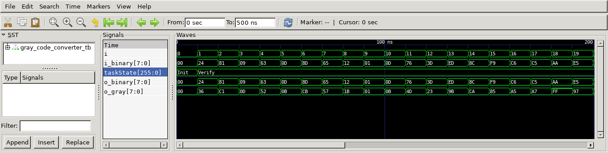

# Gray Code Converter
## Operation Principle
- Consecutive numbers differ in only one bit position.
- Bin -> Gray
	- G[N-1]	= B[N-1]
	- G[i]		= B[i+1] ^ B[i]

- Gray -> Bin
	- B[N-1]	= G[N-1]
	- B[i]		= B[i+1] ^ G[i]


## Verilog Code
###DUT
```verilog
// ==================================================
//	[ ZARAM OJT. ]
//	* Author		: Seok Jin Son (sonsj98@zaram.com)
//	* Filename		: gray_code_converter.v
//	* Date			: 2024-06-28 17:04:30
//	* Description	:
// ==================================================

module bin_to_gray
#(
	parameter BW_DATA = 8
)
(
	output	[BW_DATA-1:0] o_gray,
	input	[BW_DATA-1:0] i_binary
);
	

	assign o_gray[BW_DATA-1] = i_binary[BW_DATA-1];

	genvar i;
	generate
		for (i=0; i<BW_DATA-1; i=i+1) begin
			assign o_gray[i] = i_binary[i+1]^i_binary[i];
		end
	endgenerate

endmodule


module gray_to_bin
#(
	parameter BW_DATA = 8
)
(
	output	[BW_DATA-1:0] o_binary,
	input	[BW_DATA-1:0] i_gray
);
	

	assign o_binary[BW_DATA-1] = i_gray[BW_DATA-1];

	genvar i;
	generate
		for (i=0; i<BW_DATA-1; i=i+1) begin
			assign o_binary[i] = o_binary[i+1]^i_gray[i];
		end
	endgenerate


endmodule	
```


### Testbench
```verilog
// ==================================================
//	[ ZARAM OJT. ]
//	* Author		: Seok Jin Son (sonsj98@zaram.com)
//	* Filename		: gray_code_converter_tb.v
//	* Date			: 2024-06-28 17:19:54
//	* Description	:
// ==================================================

// --------------------------------------------------
//	Define Global Variables
// --------------------------------------------------
`define	CLKFREQ		100		// Clock Freq. (Unit: MHz)
`define	SIMCYCLE	50	// Sim. Cycles
`define BW_DATA		8		// Bitwidth of ~~

// --------------------------------------------------
//	Includes
// --------------------------------------------------
`include	"gray_code_converter.v"

module gray_code_converter_tb;
// --------------------------------------------------
//	DUT Signals & Instantiate
// --------------------------------------------------
	wire	[`BW_DATA-1:0] o_gray;
	reg		[`BW_DATA-1:0] i_binary;
	wire	[`BW_DATA-1:0] o_binary;


	bin_to_gray
	#(
	.BW_DATA			(`BW_DATA			)
	)
	u_bin_to_gray(
	.o_gray				(o_gray				),
	.i_binary			(i_binary			)
	);


	gray_to_bin
	#(
	.BW_DATA			(`BW_DATA			)
	)
	u_gray_to_bin(
	.o_binary			(o_binary			),
	.i_gray				(o_gray				)
	);


// ----------------------------------
// Tasks
// ----------------------------------
	reg [8*32-1:0] 	taskState;

	task init;
		begin
			taskState	= "Init";
			i_binary	= 0;
		end
	endtask


// --------------------------------------------------
//	Test Stimulus
// --------------------------------------------------
	integer		i, j;
	initial begin
		init();
		for (i=0; i<`SIMCYCLE; i++) begin
		#(1000/`CLKFREQ);
		taskState	= "Verify";
		i_binary	= $urandom;
		end
		$finish;
	end

// --------------------------------------------------
//	Dump VCD
// --------------------------------------------------
	reg	[8*32-1:0]	vcd_file;
	initial begin
		if ($value$plusargs("vcd_file=%s", vcd_file)) begin
			$dumpfile(vcd_file);
			$dumpvars;
		end else begin
			$dumpfile("gray_code_converter_tb.vcd");
			$dumpvars;
		end
	end

endmodule
```

## Simulation Result
- i_binary = o_binary



