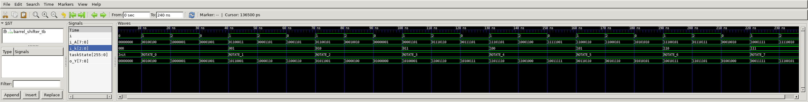

# Barrel Shifter
## Operation Principle
- Right rotate shifter
	- i_k[2] = 1 --> right rotate +4		
	- i_k[1] = 1 --> right rotate +2		
	- i_k[0] = 1 --> right rotate +1		


## Verilog Code
###DUT
```verilog
// ==================================================
//	[ ZARAM OJT. ]
//	* Author		: Seok Jin Son (sonsj98@zaram.com)
//	* Filename		: barrel_shifter.v
//	* Date			: 2024-07-01 10:33:13
//	* Description	:
// ==================================================

module barrel_shifter 
(
	output	[7:0]	o_Y,
	input 	[7:0]	i_A,
	input	[2:0]	i_k
);
	
	wire	[7:0]	w_rotate_4;
	wire	[7:0] 	w_rotate_2;

//	mux2
//	u_mux2(
//	.o_out				(w_rotate_4[0]		),	//0,1,2,3 4,5,6,7   i
//	.i_sel				(i_k[2]				),	//fix 2
//	.i_in0				(i_A[0]				),	//0,1,2,3 4,5,6,7  	i
//	.i_in1				(i_A[4]				) 	//4,5,6,7 0,1,2,3   i+4 i-4
//	);


	mux2
	u_mux2_4R_0(
	.o_out				(w_rotate_4[0]		),	
	.i_sel				(i_k[2]				),	
	.i_in0				(i_A[0]				),	
	.i_in1				(i_A[4]				) 	
	);

	mux2
	u_mux2_4R_1(
	.o_out				(w_rotate_4[1]		),	
	.i_sel				(i_k[2]				),	
	.i_in0				(i_A[1]				),	
	.i_in1				(i_A[5]				) 	
	);

	mux2
	u_mux2_4R_2(
	.o_out				(w_rotate_4[2]		),
	.i_sel				(i_k[2]				),
	.i_in0				(i_A[2]				),
	.i_in1				(i_A[6]				) 
	);

	mux2
	u_mux2_4R_3(
	.o_out				(w_rotate_4[3]		),	
	.i_sel				(i_k[2]				),	
	.i_in0				(i_A[3]				),	
	.i_in1				(i_A[7]				) 	
	);

	mux2
	u_mux2_4R_4(
	.o_out				(w_rotate_4[4]		),	
	.i_sel				(i_k[2]				),	
	.i_in0				(i_A[4]				),	
	.i_in1				(i_A[0]				) 	
	);

	mux2
	u_mux2_4R_5(
	.o_out				(w_rotate_4[5]		),	
	.i_sel				(i_k[2]				),	
	.i_in0				(i_A[5]				),	
	.i_in1				(i_A[1]				) 	
	);

	mux2
	u_mux2_4R_6(
	.o_out				(w_rotate_4[6]		),	
	.i_sel				(i_k[2]				),	
	.i_in0				(i_A[6]				),	
	.i_in1				(i_A[2]				) 	
	);

	mux2
	u_mux2_4R_7(
	.o_out				(w_rotate_4[7]		),	
	.i_sel				(i_k[2]				),	
	.i_in0				(i_A[7]				),	
	.i_in1				(i_A[3]				) 	
	);


//	mux2
//	u_mux2(
//	.o_out				(w_rotate_2[0]		),	//0,1,2,3 4,5,6,7   i
//	.i_sel				(i_k[1]				),	//fix 1
//	.i_in0				(w_rotate_4[0]		),	//0,1,2,3,4,5 6,7  	i
//	.i_in1				(w_rotate_4[2]		) 	//2,3,4,5,6,7 0,1   i+2 i-6
//	);

	mux2
	u_mux2_2R_0(
	.o_out				(w_rotate_2[0]		),	
	.i_sel				(i_k[1]				),	
	.i_in0				(w_rotate_4[0]		),	
	.i_in1				(w_rotate_4[2]		) 	
	);

	mux2
	u_mux2_2R_1(
	.o_out				(w_rotate_2[1]		),	
	.i_sel				(i_k[1]				),	
	.i_in0				(w_rotate_4[1]		),	
	.i_in1				(w_rotate_4[3]		) 	
	);

	mux2
	u_mux2_2R_2(
	.o_out				(w_rotate_2[2]		),	
	.i_sel				(i_k[1]				),	
	.i_in0				(w_rotate_4[2]		),	
	.i_in1				(w_rotate_4[4]		) 	
	);

	mux2
	u_mux2_2R_3(
	.o_out				(w_rotate_2[3]		),	
	.i_sel				(i_k[1]				),	
	.i_in0				(w_rotate_4[3]		),	
	.i_in1				(w_rotate_4[5]		) 	
	);

	mux2
	u_mux2_2R_4(
	.o_out				(w_rotate_2[4]		),	
	.i_sel				(i_k[1]				),	
	.i_in0				(w_rotate_4[4]		),	
	.i_in1				(w_rotate_4[6]		) 	
	);

	mux2
	u_mux2_2R_5(
	.o_out				(w_rotate_2[5]		),	
	.i_sel				(i_k[1]				),	
	.i_in0				(w_rotate_4[5]		),	
	.i_in1				(w_rotate_4[7]		) 	
	);

	mux2
	u_mux2_2R_6(
	.o_out				(w_rotate_2[6]		),	
	.i_sel				(i_k[1]				),	
	.i_in0				(w_rotate_4[6]		),	
	.i_in1				(w_rotate_4[0]		) 	
	);

	mux2
	u_mux2_2R_7(
	.o_out				(w_rotate_2[7]		),	
	.i_sel				(i_k[1]				),	
	.i_in0				(w_rotate_4[7]		),	
	.i_in1				(w_rotate_4[1]		) 	
	);

//	mux2
//	u_mux2(
//	.o_out				(o_Y[0]				),	//0,1,2,3 4,5,6,7   i
//	.i_sel				(i_k[0]				),	//fix 0
//	.i_in0				(w_rotate_2[0]		),	//0,1,2,3,4,5,6 7  	i
//	.i_in1				(w_rotate_2[1]		) 	//1,2,3,4,5,6,7 0   i+1 i-7
//	);

	mux2
	u_mux2_1R_0(
	.o_out				(o_Y[0]		  		),	
	.i_sel				(i_k[0]		    	),	
	.i_in0				(w_rotate_2[0]		),	
	.i_in1				(w_rotate_2[1]		) 	
	);

	mux2
	u_mux2_1R_1(
	.o_out				(o_Y[1]		  		),	
	.i_sel				(i_k[0]		    	),	
	.i_in0				(w_rotate_2[1]		),	
	.i_in1				(w_rotate_2[2]		) 	
	);

	mux2
	u_mux2_1R_2(
	.o_out				(o_Y[2]		  		),	
	.i_sel				(i_k[0]		    	),	
	.i_in0				(w_rotate_2[2]		),	
	.i_in1				(w_rotate_2[3]		) 	
	);

	mux2
	u_mux2_1R_3(
	.o_out				(o_Y[3]		  		),	
	.i_sel				(i_k[0]		    	),	
	.i_in0				(w_rotate_2[3]		),	
	.i_in1				(w_rotate_2[4]		) 	
	);

	mux2
	u_mux2_1R_4(
	.o_out				(o_Y[4]		  		),	
	.i_sel				(i_k[0]		    	),	
	.i_in0				(w_rotate_2[4]		),	
	.i_in1				(w_rotate_2[5]		) 	
	);

	mux2
	u_mux2_1R_5(
	.o_out				(o_Y[5]		  		),	
	.i_sel				(i_k[0]		    	),	
	.i_in0				(w_rotate_2[5]		),	
	.i_in1				(w_rotate_2[6]		) 	
	);

	mux2
	u_mux2_1R_6(
	.o_out				(o_Y[6]		  		),	
	.i_sel				(i_k[0]		    	),	
	.i_in0				(w_rotate_2[6]		),	
	.i_in1				(w_rotate_2[7]		) 	
	);

	mux2
	u_mux2_1R_7(
	.o_out				(o_Y[7]		  		),	
	.i_sel				(i_k[0]		    	),	
	.i_in0				(w_rotate_2[7]		),	
	.i_in1				(w_rotate_2[0]		) 	
	);

endmodule


module mux2 
(
	output	reg	o_out,
	input		i_sel,
	input		i_in0,
	input		i_in1
);

	always @ (*) begin
		case(i_sel)
			0:			o_out = i_in0;
			1:			o_out = i_in1;
			default:	o_out = i_in1;
		endcase
	end

endmodule

```

### Testbench
```verilog
// ==================================================
//	[ ZARAM OJT. ]
//	* Author		: Seok Jin Son (sonsj98@zaram.com)
//	* Filename		: barrel_shifter_tb.v
//	* Date			: 2024-07-01 10:16:33
//	* Description	:
// ==================================================

// --------------------------------------------------
//	Define Global Variables
// --------------------------------------------------
`define	CLKFREQ		100		// Clock Freq. (Unit: MHz)
`define	SIMCYCLE	3		// Sim. Cycles

// --------------------------------------------------
//	Includes
// --------------------------------------------------
`include	"barrel_shifter.v"

module barrel_shifter_tb;
// --------------------------------------------------
//	DUT Signals & Instantiate
// --------------------------------------------------
	wire	[7:0]	o_Y;
	reg 	[7:0]	i_A;
	reg		[2:0]	i_k;

	barrel_shifter
	u_barrel_shifter(
	.o_Y				(o_Y				),
	.i_A				(i_A				),
	.i_k				(i_k				)
	);


// ----------------------------------
// Tasks
// ----------------------------------
	reg [8*32-1:0] 	taskState;

	task init;
		begin
			taskState	= "Init";
			i_A			= 0;
			i_k			= 0;
		end
	endtask

// --------------------------------------------------
//	Test Stimulus
// --------------------------------------------------
	integer		i, j;
	initial begin
		init();

		for (i=0; i<`SIMCYCLE; i++) begin
			#(1000/`CLKFREQ);
			taskState	= "ROTATE_0";
			i_k[0]		= 0;
			i_k[1]		= 0;
			i_k[2]		= 0;
			i_A			= $urandom;
		end

		for (i=0; i<`SIMCYCLE; i++) begin
			#(1000/`CLKFREQ);
			taskState	= "ROTATE_1";
			i_k[0]		= 1;
			i_k[1]		= 0;
			i_k[2]		= 0;
			i_A			= $urandom;
		end

		for (i=0; i<`SIMCYCLE; i++) begin
			#(1000/`CLKFREQ);
			taskState	= "ROTATE_2";
			i_k[0]		= 0;
			i_k[1]		= 1;
			i_k[2]		= 0;
			i_A			= $urandom;
		end

		for (i=0; i<`SIMCYCLE; i++) begin
			#(1000/`CLKFREQ);
			taskState	= "ROTATE_3";
			i_k[0]		= 1;
			i_k[1]		= 1;
			i_k[2]		= 0;
			i_A			= $urandom;
		end

		for (i=0; i<`SIMCYCLE; i++) begin
			#(1000/`CLKFREQ);
			taskState	= "ROTATE_4";
			i_k[0]		= 0;
			i_k[1]		= 0;
			i_k[2]		= 1;
			i_A			= $urandom;
		end

		for (i=0; i<`SIMCYCLE; i++) begin
			#(1000/`CLKFREQ);
			taskState	= "ROTATE_5";
			i_k[0]		= 1;
			i_k[1]		= 0;
			i_k[2]		= 1;
			i_A			= $urandom;
		end

		for (i=0; i<`SIMCYCLE; i++) begin
			#(1000/`CLKFREQ);
			taskState	= "ROTATE_6";
			i_k[0]		= 0;
			i_k[1]		= 1;
			i_k[2]		= 1;
			i_A			= $urandom;
		end

		for (i=0; i<`SIMCYCLE; i++) begin
			#(1000/`CLKFREQ);
			taskState	= "ROTATE_7";
			i_k[0]		= 1;
			i_k[1]		= 1;
			i_k[2]		= 1;
			i_A			= $urandom;
		end

		$finish;
	end

// --------------------------------------------------
//	Dump VCD
// --------------------------------------------------
	reg	[8*32-1:0]	vcd_file;
	initial begin
		if ($value$plusargs("vcd_file=%s", vcd_file)) begin
			$dumpfile(vcd_file);
			$dumpvars;
		end else begin
			$dumpfile("barrel_shifter_tb.vcd");
			$dumpvars;
		end
	end

endmodule
```

## Simulation Result
	- The value A is right rotated based on the value k.



