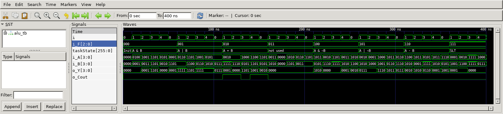

# Gray Code Converter
## Operation Principle
- Arithmetic Logic Unit (ALU)
	- F = 000 --> Y = A & B
	- F = 001 --> Y = A | B
	- F = 010 --> Y = A + B
	- F = 011 --> Y = not used
	- F = 100 --> Y = A & ~B
	- F = 101 --> Y = A | ~B
	- F = 110 --> Y = A - B
	- F = 111 --> Y = SLT

## Verilog Code
###DUT
```verilog
	// ==================================================
	//	[ ZARAM OJT. ]
	//	* Author		: Seok Jin Son (sonsj98@zaram.com)
	//	* Filename		: alu.v
	//	* Date			: 2024-07-01 15:36:05
	//	* Description	:
	// ==================================================
	
	module alu 
	#(
		parameter BW_DATA = 4
	)
	(
		output	reg	[BW_DATA-1:0]	o_Y,
		output	reg					o_Cout,
		input		[BW_DATA-1:0]	i_A,
		input		[BW_DATA-1:0]	i_B,
		input		[2:0]			i_F
	);
		
	
		always @ (*) begin
			o_Cout	= 0;
			case (i_F)
				3'b000 	: o_Y			= i_A & i_B;
				3'b001 	: o_Y 			= i_A | i_B;
				3'b010 	: {o_Cout, o_Y} = i_A + i_B;
				3'b011 	: o_Y 			= 0;
				3'b100 	: o_Y 			= i_A & ~i_B;
				3'b101 	: o_Y 			= i_A | ~i_B;
				3'b110 	: o_Y			= i_A - i_B;
				3'b111 	: o_Y			= (i_A < i_B) ? 1 : 0;
				default : o_Y			= 0;
			endcase
		end
	
	
	endmodule
```


### Testbench
```verilog
	// ==================================================
	//	[ ZARAM OJT. ]
	//	* Author		: Seok Jin Son (sonsj98@zaram.com)
	//	* Filename		: alu_tb.v
	//	* Date			: 2024-07-01 15:50:14
	//	* Description	:
	// ==================================================
	
	// --------------------------------------------------
	//	Define Global Variables
	// --------------------------------------------------
	`define	CLKFREQ		100		// Clock Freq. (Unit: MHz)
	`define	SIMCYCLE	5		// Sim. Cycles
	`define BW_DATA		4
	
	// --------------------------------------------------
	//	Includes
	// --------------------------------------------------
	`include	"alu.v"
	
	module alu_tb;
	// --------------------------------------------------
	//	DUT Signals & Instantiate
	// --------------------------------------------------
		wire	[`BW_DATA-1:0]	o_Y;
		wire					o_Cout;
		reg		[`BW_DATA-1:0]	i_A;
		reg		[`BW_DATA-1:0]	i_B;
		reg		[2:0]			i_F;
	
		alu
		#(
		.BW_DATA			(`BW_DATA			)
		)
		u_alu(
		.o_Y				(o_Y				),
		.o_Cout				(o_Cout				),
		.i_A				(i_A				),
		.i_B				(i_B				),
		.i_F				(i_F				)
		);
	
	
	
	// ----------------------------------
	// Tasks
	// ----------------------------------
		reg [8*32-1:0] 	taskState;
	
		task init;
			begin
				taskState	= "Init";
				i_A  		= 0;
				i_B  		= 0;
				i_F			= 0;
			end
		endtask
	
	// --------------------------------------------------
	//	Test Stimulus
	// --------------------------------------------------
		integer		i, j;
		initial begin
			init();
	
			for (i=0; i<`SIMCYCLE; i++) begin
				#(1000/`CLKFREQ);
				taskState	= "A & B";
	            i_F	= 3'b000;
				i_A	= $urandom;
	            i_B	= $urandom;
			end
	
			for (i=0; i<`SIMCYCLE; i++) begin
				#(1000/`CLKFREQ);
				taskState	= "A | B";
	            i_F	= 3'b001;
				i_A	= $urandom;
	            i_B	= $urandom;
			end
	
			for (i=0; i<`SIMCYCLE; i++) begin
				#(1000/`CLKFREQ);
				taskState	= "A + B";
	            i_F	= 3'b010;
				i_A	= $urandom;
	            i_B	= $urandom;
			end
	
			for (i=0; i<`SIMCYCLE; i++) begin
				#(1000/`CLKFREQ);
				taskState	= "not used";
	            i_F	= 3'b011;
				i_A	= $urandom;
	            i_B	= $urandom;
			end
	
			for (i=0; i<`SIMCYCLE; i++) begin
				#(1000/`CLKFREQ);
				taskState	= "A & ~B";
	            i_F	= 3'b100;
				i_A	= $urandom;
	            i_B	= $urandom;
			end
	
			for (i=0; i<`SIMCYCLE; i++) begin
				#(1000/`CLKFREQ);
				taskState	= "A | ~B";
	            i_F	= 3'b101;
				i_A	= $urandom;
	            i_B	= $urandom;
			end
	
			for (i=0; i<`SIMCYCLE; i++) begin
				#(1000/`CLKFREQ);
				taskState	= "A - B";
	            i_F	= 3'b110;
				i_A	= $urandom;
	            i_B	= $urandom;
			end
	
			for (i=0; i<`SIMCYCLE; i++) begin
				#(1000/`CLKFREQ);
				taskState	= "SLT";
	            i_F	= 3'b111;
				i_A	= $urandom;
	            i_B	= $urandom;
			end
	
			$finish;
		end
	
	// --------------------------------------------------
	//	Dump VCD
	// --------------------------------------------------
		reg	[8*32-1:0]	vcd_file;
		initial begin
			if ($value$plusargs("vcd_file=%s", vcd_file)) begin
				$dumpfile(vcd_file);
				$dumpvars;
			end else begin
				$dumpfile("alu_tb.vcd");
				$dumpvars;
			end
		end
	
	endmodule
```

## Simulation Result
- The output is determined based on the value of F.



