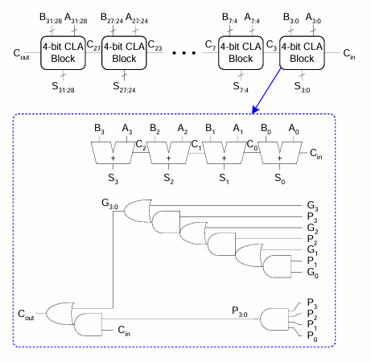
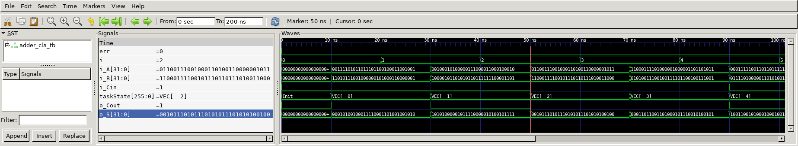

# Adder CLA
## Operation Principle
- 32-bit Carry-Lookahead Adder
	- 32bit CLA = 8 x 4bit CLA
	- 4bit CLA = 4bit FA + 4bit PG logic 
		- G = A & B
		- P = A ^ B

	

## Verilog Code
###DUT
```verilog
// ==================================================
//	[ ZARAM OJT. ]
//	* Author		: Seok Jin Son (sonsj98@zaram.com)
//	* Filename		: adder_cla.v
//	* Date			: 2024-07-01 11:35:51
//	* Description	:
// ==================================================

module adder_cla32
(
	output		[32-1:0]		o_S,
	output						o_Cout,
	input		[32-1:0]		i_A,
	input		[32-1:0]		i_B,
	input						i_Cin
);
	
	wire		[32/4 -2:0]	w_Cout; //3, 7, 11, 15, 19, 23, 27, (31=Cout)

	full_adder4
	u_full_adder4_0(
	.o_S				(o_S[3:0]			),
	.o_Cout				(					),
	.i_A				(i_A[3:0]			),
	.i_B				(i_B[3:0]			),
	.i_Cin				(i_Cin				)
	);

	PG_logic4
	u_PG_logic4_0(
	.o_Cout				(w_Cout[0]			),
	.i_A				(i_A[3:0]			),
	.i_B				(i_B[3:0]			),
	.i_Cin				(i_Cin				)
	);

	full_adder4
	u_full_adder4_1(
	.o_S				(o_S[7:4]			),
	.o_Cout				(					),
	.i_A				(i_A[7:4]			),
	.i_B				(i_B[7:4]			),
	.i_Cin				(w_Cout[0]			)
	);

	PG_logic4
	u_PG_logic4_1(
	.o_Cout				(w_Cout[1]			),
	.i_A				(i_A[7:4]			),
	.i_B				(i_B[7:4]			),
	.i_Cin				(w_Cout[0]			)
	);

	full_adder4
	u_full_adder4_2(
	.o_S				(o_S[11:8]			),
	.o_Cout				(					),
	.i_A				(i_A[11:8]			),
	.i_B				(i_B[11:8]			),
	.i_Cin				(w_Cout[1]			)
	);

	PG_logic4
	u_PG_logic4_2(
	.o_Cout				(w_Cout[2]			),
	.i_A				(i_A[11:8]			),
	.i_B				(i_B[11:8]			),
	.i_Cin				(w_Cout[1]			)
	);

	full_adder4
	u_full_adder4_3(
	.o_S				(o_S[15:12]			),
	.o_Cout				(					),
	.i_A				(i_A[15:12]			),
	.i_B				(i_B[15:12]			),
	.i_Cin				(w_Cout[2]			)
	);

	PG_logic4
	u_PG_logic4_3(
	.o_Cout				(w_Cout[3]			),
	.i_A				(i_A[15:12]			),
	.i_B				(i_B[15:12]			),
	.i_Cin				(w_Cout[2]			)
	);

	full_adder4
	u_full_adder4_4(
	.o_S				(o_S[19:16]			),
	.o_Cout				(					),
	.i_A				(i_A[19:16]			),
	.i_B				(i_B[19:16]			),
	.i_Cin				(w_Cout[3]			)
	);

	PG_logic4
	u_PG_logic4_4(
	.o_Cout				(w_Cout[4]			),
	.i_A				(i_A[19:16]			),
	.i_B				(i_B[19:16]			),
	.i_Cin				(w_Cout[3]			)
	);

	full_adder4
	u_full_adder4_5(
	.o_S				(o_S[23:20]			),
	.o_Cout				(					),
	.i_A				(i_A[23:20]			),
	.i_B				(i_B[23:20]			),
	.i_Cin				(w_Cout[4]			)
	);

	PG_logic4
	u_PG_logic4_5(
	.o_Cout				(w_Cout[5]			),
	.i_A				(i_A[23:20]			),
	.i_B				(i_B[23:20]			),
	.i_Cin				(w_Cout[4]			)
	);

	full_adder4
	u_full_adder4_6(
	.o_S				(o_S[27:24]			),
	.o_Cout				(					),
	.i_A				(i_A[27:24]			),
	.i_B				(i_B[27:24]			),
	.i_Cin				(w_Cout[5]			)
	);

	PG_logic4
	u_PG_logic4_6(
	.o_Cout				(w_Cout[6]			),
	.i_A				(i_A[27:24]			),
	.i_B				(i_B[27:24]			),
	.i_Cin				(w_Cout[5]			)
	);

	full_adder4
	u_full_adder4_7(
	.o_S				(o_S[31:28]			),
	.o_Cout				(					),
	.i_A				(i_A[31:28]			),
	.i_B				(i_B[31:28]			),
	.i_Cin				(w_Cout[6]			)
	);

	PG_logic4
	u_PG_logic4_7(
	.o_Cout				(o_Cout				),
	.i_A				(i_A[31:28]			),
	.i_B				(i_B[31:28]			),
	.i_Cin				(w_Cout[6]			)
	);

endmodule


module full_adder4
(	
	output		[3:0]	o_S,
	output				o_Cout,
	input		[3:0]	i_A,
	input		[3:0]	i_B,
	input				i_Cin
);

	assign	{o_Cout, o_S} = i_A + i_B + i_Cin;

endmodule

module PG_logic4
(
	output			o_Cout,
	input	[3:0]	i_A,
	input	[3:0]	i_B,
	input			i_Cin
);

	wire	[3:0]	w_G;
	wire	[3:0]	w_P;
	wire			w_GN;
	wire			w_PN;

	genvar i;
	
	generate
	for (i=0; i<4; i=i+1) begin

		assign	w_G[i] = i_A[i] & i_B[i];
		assign	w_P[i] = i_A[i] ^ i_B[i];

	end
	endgenerate

	assign w_GN = w_G[3] | (w_P[3] & (w_G[2] | (w_P[2] & (w_G[1] | (w_P[1] & w_G[0]))))); 
	assign w_PN = w_P[0] & w_P[1] & w_P[2] & w_P[3];
	
	assign o_Cout = w_GN | (w_PN & i_Cin);


endmodule
```

### Testbench
```verilog
// ==================================================
//	[ ZARAM OJT. ]
//	* Author		: Seok Jin Son (sonsj98@zaram.com)
//	* Filename		: adder_cla_tb.v
//	* Date			: 2024-07-01 14:54:12
//	* Description	:
// ==================================================

// --------------------------------------------------
//	Define Global Variables
// --------------------------------------------------
`define	CLKFREQ		100		// Clock Freq. (Unit: MHz)
`define	SIMCYCLE	`NVEC	// Sim. Cycles
`define BW_DATA		32		// Bitwidth of ~~
`define NVEC		10		// # of Test Vector

// --------------------------------------------------
//	Includes
// --------------------------------------------------
`include	"adder_cla.v"

module adder_cla_tb;
// --------------------------------------------------
//	DUT Signals & Instantiate
// --------------------------------------------------
	wire	[32-1:0]		o_S;
	wire					o_Cout;
	reg		[32-1:0]		i_A;
	reg		[32-1:0]		i_B;
	reg						i_Cin;

	adder_cla32
	u_adder_cla32(
	.o_S				(o_S				),
	.o_Cout				(o_Cout				),
	.i_A				(i_A				),
	.i_B				(i_B				),
	.i_Cin				(i_Cin				)
	);

// --------------------------------------------------
//	Test Vector Configuration
// --------------------------------------------------
	reg		[`BW_DATA-1:0]	vo_s[0:`NVEC-1];
	reg						vo_c[0:`NVEC-1];
	reg		[`BW_DATA-1:0]	vi_a[0:`NVEC-1];
	reg		[`BW_DATA-1:0]	vi_b[0:`NVEC-1];
	reg						vi_c[0:`NVEC-1];

	initial begin
		$readmemb("./vec/o_s.vec",			vo_s);
		$readmemb("./vec/o_c.vec",			vo_c);
		$readmemb("./vec/i_a.vec",			vi_a);
		$readmemb("./vec/i_b.vec",			vi_b);
		$readmemb("./vec/i_c.vec",			vi_c);
	end

// ----------------------------------
// Tasks
// ----------------------------------
	reg [8*32-1:0] 	taskState;
	reg 			err;

	task init;
		begin
			taskState	= "Init";
			err			= 0;
			i_A  		= 0;
			i_B  		= 0;
			i_Cin		= 0;
		end
	endtask

	task vecInsert;
		input	[$clog2(`NVEC)-1:0]	i;
		begin
			$sformat(taskState,	"VEC[%3d]", i);
			i_A				= vi_a[i];
			i_B				= vi_b[i];
			i_Cin			= vi_c[i];
		end
	endtask

	task vecVerify;
		input	[$clog2(`NVEC)-1:0]	i;
		begin
			#(0.1*1000/`CLKFREQ);
			if (o_S				!= vo_s[i]) begin $display("[Idx: %3d] Mismatched o_S", i); end
			if (o_Cout			!= vo_c[i]) begin $display("[Idx: %3d] Mismatched o_Cout", i); end
			if ((o_S != vo_s[i]) || (o_Cout != vo_c[i])) begin err++; end
			#(0.9*1000/`CLKFREQ);
		end
	endtask

// --------------------------------------------------
//	Test Stimulus
// --------------------------------------------------
	integer		i, j;
	initial begin
		init();

		for (i=0; i<`SIMCYCLE; i++) begin
			#(1000/`CLKFREQ);
			vecInsert(i);
			vecVerify(i);			
		end
		$finish;
	end

// --------------------------------------------------
//	Dump VCD
// --------------------------------------------------
	reg	[8*32-1:0]	vcd_file;
	initial begin
		if ($value$plusargs("vcd_file=%s", vcd_file)) begin
			$dumpfile(vcd_file);
			$dumpvars;
		end else begin
			$dumpfile("adder_cla_tb.vcd");
			$dumpvars;
		end
	end

endmodule
```

## Simulation Result
- i_A + i_B + i_Cin = o_S (carry : o_Cout)



