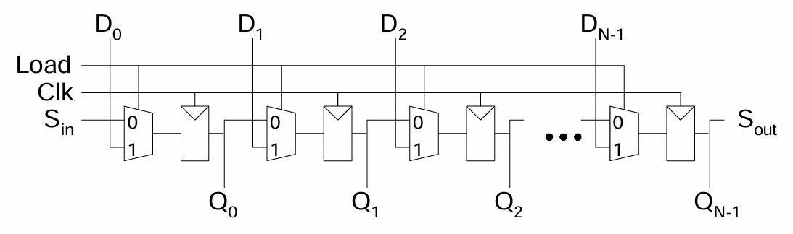
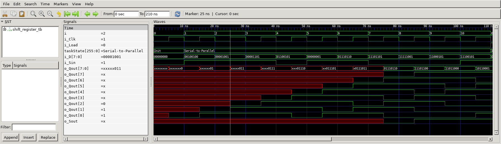
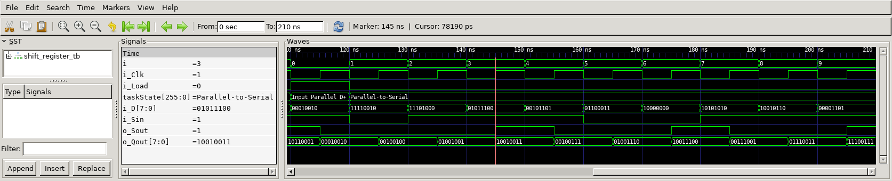

# Shift Register
## Operation Principle
- Serial-to-Parallel converter: i_Sin to o_Qout[0:N-1] 
	- i_Load = 1

- Parallel-to-Serial converter: i_D[0:N-1] to o_Sout
	- First CLK cycle i_Load = 1, Other cycle i_Load = 0





## Verilog Code
###DUT
```verilog
	// ==================================================
	//	[ ZARAM OJT. ]
	//	* Author		: Seok Jin Son (sonsj98@zaram.com)
	//	* Filename		: shift_register.v
	//	* Date			: 2024-07-01 16:54:57
	//	* Description	:
	// ==================================================
	
	module shift_register 
	(
		output					o_Sout,
		output		[8-1:0]		o_Qout,
		input		[8-1:0] 	i_D,
		input					i_Load,
		input					i_Sin,
		input					i_Clk
	);
	
		mux_dff
		u_mux_dff_0(
		.o_out				(o_Qout[0]			),
		.i_in0				(i_Sin				),
		.i_in1				(i_D[0]				),
		.i_sel				(i_Load				),
		.i_clk				(i_Clk				)
		);
	
		mux_dff
		u_mux_dff_1(
		.o_out				(o_Qout[1]			),
		.i_in0				(o_Qout[0]			),
		.i_in1				(i_D[1]				),
		.i_sel				(i_Load				),
		.i_clk				(i_Clk				)
		);
	
		mux_dff
		u_mux_dff_2(
		.o_out				(o_Qout[2]			),
		.i_in0				(o_Qout[1]			),
		.i_in1				(i_D[2]				),
		.i_sel				(i_Load				),
		.i_clk				(i_Clk				)
		);
	
		mux_dff
		u_mux_dff_3(
		.o_out				(o_Qout[3]			),
		.i_in0				(o_Qout[2]			),
		.i_in1				(i_D[3]				),
		.i_sel				(i_Load				),
		.i_clk				(i_Clk				)
		);
	
		mux_dff
		u_mux_dff_4(
		.o_out				(o_Qout[4]			),
		.i_in0				(o_Qout[3]			),
		.i_in1				(i_D[4]				),
		.i_sel				(i_Load				),
		.i_clk				(i_Clk				)
		);
	
		mux_dff
		u_mux_dff_5(
		.o_out				(o_Qout[5]			),
		.i_in0				(o_Qout[4]			),
		.i_in1				(i_D[5]				),
		.i_sel				(i_Load				),
		.i_clk				(i_Clk				)
		);
	
		mux_dff
		u_mux_dff_6(
		.o_out				(o_Qout[6]			),
		.i_in0				(o_Qout[5]			),
		.i_in1				(i_D[6]				),
		.i_sel				(i_Load				),
		.i_clk				(i_Clk				)
		);
	
		mux_dff
		u_mux_dff_7(
		.o_out				(o_Qout[7]			),
		.i_in0				(o_Qout[6]			),
		.i_in1				(i_D[7]				),
		.i_sel				(i_Load				),
		.i_clk				(i_Clk				)
		);
	
		assign o_Sout = o_Qout[7];
		
	endmodule
	
	
	
	module mux_dff
	(
		output	reg	o_out,
		input		i_in0,
		input		i_in1,
		input		i_sel,
		input		i_clk
	);
		
		wire	w_mux_out;
		
		assign	w_mux_out = i_sel ? i_in1 : i_in0;
	
		always @ (posedge i_clk) begin
			o_out = w_mux_out;
		end
	
	endmodule
```


### Testbench
```verilog
	// ==================================================
	//	[ ZARAM OJT. ]
	//	* Author		: Seok Jin Son (sonsj98@zaram.com)
	//	* Filename		: shift_register_tb.v
	//	* Date			: 2024-07-01 17:26:45
	//	* Description	:
	// ==================================================
	
	// --------------------------------------------------
	//	Define Global Variables
	// --------------------------------------------------
	`define	CLKFREQ		100		// Clock Freq. (Unit: MHz)
	`define	SIMCYCLE	20		// Sim. Cycles
	
	// --------------------------------------------------
	//	Includes
	// --------------------------------------------------
	`include	"shift_register.v"
	
	module shift_register_tb;
	// --------------------------------------------------
	//	DUT Signals & Instantiate
	// --------------------------------------------------
		wire				o_Sout;
		wire	[8-1:0]		o_Qout;
		reg		[8-1:0] 	i_D;
		reg					i_Load;
		reg					i_Sin;
		reg					i_Clk;
	
		shift_register
		u_shift_register(
		.o_Sout				(o_Sout				),
		.o_Qout				(o_Qout				),
		.i_D				(i_D				),
		.i_Load				(i_Load				),
		.i_Sin				(i_Sin				),
		.i_Clk				(i_Clk				)
		);
	
	
	// ----------------------------------
	// Clock
	// ----------------------------------
		always	#(500/`CLKFREQ) i_Clk = ~ i_Clk;
	
	// ----------------------------------
	// Tasks
	// ----------------------------------
		reg [8*32-1:0] 	taskState;
	
		task init;
			begin
				taskState	= "Init";
				i_D  		= 0;
				i_Load 		= 0;
				i_Sin		= 0;
				i_Clk		= 0;
			end
		endtask
	
	
	// --------------------------------------------------
	//	Test Stimulus
	// --------------------------------------------------
		integer		i, j;
		initial begin
			init();
	
			for (i=0; i<`SIMCYCLE; i++) begin
				#(1000/`CLKFREQ);
				taskState	= "Serial-to-Parallel";
				i_Load 		= 0;
				i_D			= $urandom;
				i_Sin		= $urandom;
			end
	
				#(1000/`CLKFREQ);
				taskState	= "Input Parallel Data";
				i_Load 		= 1;
				i_D			= $urandom;
				i_Sin		= $urandom;
	
			for (i=0; i<`SIMCYCLE; i++) begin
				#(1000/`CLKFREQ);
				taskState	= "Parallel-to-Serial";
				i_Load 		= 0;
				i_D			= $urandom;
				i_Sin		= $urandom;
			end
			$finish;
		end
	
	// --------------------------------------------------
	//	Dump VCD
	// --------------------------------------------------
		reg	[8*32-1:0]	vcd_file;
		initial begin
			if ($value$plusargs("vcd_file=%s", vcd_file)) begin
				$dumpfile(vcd_file);
				$dumpvars;
			end else begin
				$dumpfile("shift_register_tb.vcd");
				$dumpvars;
			end
		end
	
	endmodule
```

## Simulation Result
- Serial-to-Parallel





- Parallel-to-Serial 



