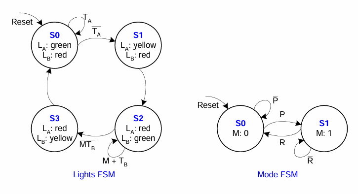
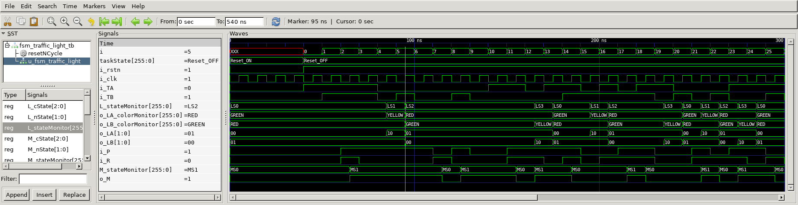

# Fsm Traffic Light
## Operation Principle
- State Machine





## Verilog Code
###DUT
```verilog
	// ==================================================
	//	[ ZARAM OJT. ]
	//	* Author		: Seok Jin Son (sonsj98@zaram.com)
	//	* Filename		: fsm_traffic_light.v
	//	* Date			: 2024-07-02 09:57:22
	//	* Description	:
	// ==================================================
	
	module fsm_traffic_light 
	(
		output	reg	[1:0]	o_LA,
		output	reg	[1:0]	o_LB,
		output	reg			o_M,
		input				i_TA,
		input				i_TB,
		input				i_P,
		input				i_R,
		input				i_clk,
		input				i_rstn
	);
	
		reg	[2:0]	L_cState;
		reg	[2:0]	M_cState;
		reg	[1:0]	L_nState;
		reg	[1:0]	M_nState;
	
	
		//===================
		// (Mode FSM)
		//===================
	
		//States 
		localparam	MS0	=	2'b00;
	    localparam	MS1 =	2'b01;
	
		//State Register
		always @(posedge i_clk or negedge i_rstn) begin
			if(!i_rstn) begin
				M_cState	<= MS0;
			end else begin
				M_cState	<= M_nState;
			end
		end
	
		//'Next State' Comb. logic
		always @(*) begin
			case (M_cState)
				MS0 : begin
					if (!i_P) begin
						M_nState = MS0;
					end else begin
						M_nState = MS1;
					end
				end
	            MS1 : begin
					if (!i_R) begin
						M_nState = MS1;
					end else begin
						M_nState = MS0;
					end
				end
			endcase
		end
	
	
	
		//'Output' Comb. Logic
		always @(*) begin
			case(M_cState)
				MS0	:	begin
					o_M = 1'b0;
				end
				LS1	:	begin
					o_M = 1'b1;
				end
			endcase
		end
	
		//===================
		// (Lights FSM)
		//===================
	
		//States
		localparam	LS0	=	3'b000;
		localparam	LS1 =	3'b001;
		localparam	LS2 =	3'b010;
		localparam	LS3	=	3'b011;
	
		//Light outputs
		localparam	GREEN	= 2'b00;
		localparam	RED		= 2'b01;
		localparam	YELLOW	= 2'b10;
	
		//State Register
		always @(posedge i_clk or negedge i_rstn) begin
			if(!i_rstn) begin
				L_cState	<= LS0;
			end else begin
				L_cState	<= L_nState;
			end
		end
	
		//'Next State' Comb. logic
		always @(*) begin
			case (L_cState)
				LS0 : begin
					if (i_TA) begin
						L_nState = LS0;
					end else begin
						L_nState = LS1;
					end
				end
	            LS1 : L_nState = LS2;
	            LS2 : begin
					if (o_M | i_TB) begin
						L_nState = LS2;
					end else begin
						L_nState = LS3;
					end
				end
	            LS3 : L_nState = LS0;
			endcase
		end
	
	
		//'Output' Comb. Logic
		always @(*) begin
			case(L_cState)
				LS0	:	begin
					o_LA = GREEN;
					o_LB = RED;
				end
				LS1	:	begin
					o_LA = YELLOW;
					o_LB = RED;
				end
				LS2	:	begin
					o_LA = RED;
					o_LB = GREEN;
				end
				LS3	:	begin
					o_LA = RED;
					o_LB = YELLOW;
				end
			endcase
		end
	
	
		//DEBUG
		`ifdef DEBUG
			reg [32*8-1:0]	L_stateMonitor;
			always @(*) begin
				case(L_cState)
				LS0:	L_stateMonitor	=	"LS0";
	            LS1:	L_stateMonitor	=	"LS1";
	            LS2:	L_stateMonitor	=	"LS2";
	            LS3:	L_stateMonitor	=	"LS3";
				endcase
			end
	
			reg [32*8-1:0]	M_stateMonitor;
			always @(*) begin
				case(M_cState)
				MS0:	M_stateMonitor	=	"MS0";
	            MS1:	M_stateMonitor	=	"MS1";
				endcase
			end
	
			reg [32*8-1:0]	o_LA_colorMonitor;
			always @(*) begin
				case(o_LA)
				GREEN	:	o_LA_colorMonitor	=	"GREEN";
	            RED		:	o_LA_colorMonitor	=	"RED";
	            YELLOW	:	o_LA_colorMonitor	=	"YELLOW";
				endcase
			end
	
			reg [32*8-1:0]	o_LB_colorMonitor;
			always @(*) begin
				case(o_LB)
				GREEN	:	o_LB_colorMonitor	=	"GREEN";
	            RED		:	o_LB_colorMonitor	=	"RED";
	            YELLOW	:	o_LB_colorMonitor	=	"YELLOW";
				endcase
			end
		`endif
		
	
	endmodule
```


### Testbench
```verilog
	// ==================================================
	//	[ ZARAM OJT. ]
	//	* Author		: Seok Jin Son (sonsj98@zaram.com)
	//	* Filename		: fsm_traffic_light_tb.v
	//	* Date			: 2024-07-02 11:39:35
	//	* Description	:
	// ==================================================
	
	// --------------------------------------------------
	//	Define Global Variables
	// --------------------------------------------------
	`define	CLKFREQ		100		// Clock Freq. (Unit: MHz)
	`define	SIMCYCLE	50		// Sim. Cycles
	`define DEBUG
	
	
	// --------------------------------------------------
	//	Includes
	// --------------------------------------------------
	`include	"fsm_traffic_light.v"
	
	module fsm_traffic_light_tb;
	// --------------------------------------------------
	//	DUT Signals & Instantiate
	// --------------------------------------------------
		wire		[1:0]	o_LA;
		wire		[1:0]	o_LB;
		wire				o_M;
		reg					i_TA;
		reg					i_TB;
		reg					i_P;
		reg					i_R;
		reg					i_clk;
		reg					i_rstn;
	
		fsm_traffic_light
		u_fsm_traffic_light(
		.o_LA				(o_LA				),
		.o_LB				(o_LB				),
		.o_M				(o_M				),
		.i_TA				(i_TA				),
		.i_TB				(i_TB				),
		.i_P				(i_P				),
		.i_R				(i_R				),
		.i_clk				(i_clk				),
		.i_rstn				(i_rstn				)
		);
	
	
	// ----------------------------------
	// Clock
	// ----------------------------------
		always	#(500/`CLKFREQ) i_clk = ~ i_clk;
	
	// ----------------------------------
	// Tasks
	// ----------------------------------
		reg [8*32-1:0] 	taskState;
	
		task init;
			begin
				taskState	= "Init";
				i_TA		= 0;
				i_TB		= 0;
				i_P			= 0;
				i_R			= 0;
				i_clk		= 0;
				i_rstn		= 0;
			end
		endtask
	
		task resetNCycle;
			input	[9:0]	n;
			begin
				taskState		= "Reset_ON";
				#(n*1000/`CLKFREQ);
				i_rstn = 1;
				taskState		= "Reset_OFF";
			end
		endtask
	
	
	// --------------------------------------------------
	//	Test Stimulus
	// --------------------------------------------------
		integer		i, j;
		initial begin
			init();
			resetNCycle(4);
	
			for (i=0; i<`SIMCYCLE; i++) begin
				i_TA	= $urandom_range(0,1);
				i_TB	= $urandom_range(0,1);
				i_P		= $urandom_range(0,1);
				i_R		= $urandom_range(0,1);
				#(1000/`CLKFREQ);
			end
			$finish;
		end
	
	// --------------------------------------------------
	//	Dump VCD
	// --------------------------------------------------
		reg	[8*32-1:0]	vcd_file;
		initial begin
			if ($value$plusargs("vcd_file=%s", vcd_file)) begin
				$dumpfile(vcd_file);
				$dumpvars;
			end else begin
				$dumpfile("fsm_traffic_light_tb.vcd");
				$dumpvars;
			end
		end
	
	endmodule

```

## Simulation Result
- Lights FSM : LS0 ~ LS3
- Mode   FSM : MS0 ~ MS1



