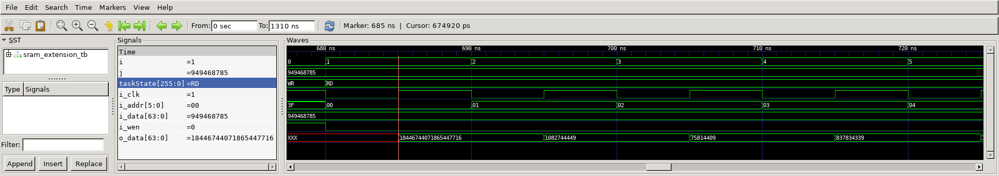

# Sram Extension
## Operation Principle
- SRAM Operation
	- Write Operation
		- i_oen, i_cen, i_wen = 1

	- Read Operation
		- i_oen, i_cen = 1, i_wen = 0

- SRAM Extension
	- (BW_DATA = 64 & BW_ADDR = 6) = (BW_DATA = 32 & BW_ADDR = 4) x 8


## Verilog Code
###DUT
```verilog
// ==================================================
//	[ ZARAM OJT. ]
//	* Author		: Seok Jin Son (sonsj98@zaram.com)
//	* Filename		: sram_extension.v
//	* Date			: 2024-07-02 13:44:12
//	* Description	:
// ==================================================

`include	"spsram.v"

module sram_extension
#(
	parameter	BW_DATA	=	64,
	parameter	BW_ADDR	=	6
)
(
	output	[BW_DATA-1:0]	o_data,
	input	[BW_DATA-1:0]	i_data,
	input	[BW_ADDR-1:0]	i_addr,
	input					i_wen,
	input					i_cen,
	input					i_oen,
	input					i_clk
);
	

	spsram
	#(
	.BW_DATA			(32			),
	.BW_ADDR			(4			)
	)
	u_spsram_0(
	.o_data				(o_data[32-1:0]			),
	.i_data				(i_data[32-1:0]			),
	.i_addr				(i_addr[3:0]			),
	.i_wen				(i_wen					),
	.i_cen				(~i_addr[5] & ~i_addr[4]),
	.i_oen				(~i_addr[5]	& ~i_addr[4]),
	.i_clk				(i_clk					)
	);


	spsram
	#(
	.BW_DATA			(32			),
	.BW_ADDR			(4			)
	)	
	u_spsram_1(
	.o_data				(o_data[32-1:0]			),
	.i_data				(i_data[32-1:0]			),
	.i_addr				(i_addr[3:0]			),
	.i_wen				(i_wen					),
	.i_cen				(~i_addr[5] & i_addr[4]	),
	.i_oen				(~i_addr[5]	& i_addr[4]	),
	.i_clk				(i_clk					)
	);

	spsram
	#(
	.BW_DATA			(32			),
	.BW_ADDR			(4			)
	)	
	u_spsram_2(
	.o_data				(o_data[32-1:0]			),
	.i_data				(i_data[32-1:0]			),
	.i_addr				(i_addr[3:0]			),
	.i_wen				(i_wen					),
	.i_cen				(i_addr[5] & ~i_addr[4]	),
	.i_oen				(i_addr[5] & ~i_addr[4]	),
	.i_clk				(i_clk					)
	);

	spsram
	#(
	.BW_DATA			(32			),
	.BW_ADDR			(4			)
	)	
	u_spsram_3(
	.o_data				(o_data[32-1:0]			),
	.i_data				(i_data[32-1:0]			),
	.i_addr				(i_addr[3:0]			),
	.i_wen				(i_wen					),
	.i_cen				(i_addr[5] & i_addr[4]	),
	.i_oen				(i_addr[5] & i_addr[4]	),
	.i_clk				(i_clk					)
	);

	spsram
	#(
	.BW_DATA			(32			),
	.BW_ADDR			(4			)
	)
	u_spsram_4(
	.o_data				(o_data[64-1:32]		),
	.i_data				(i_data[64-1:32]		),
	.i_addr				(i_addr[3:0]			),
	.i_wen				(i_wen					),
	.i_cen				(~i_addr[5] & ~i_addr[4]),
	.i_oen				(~i_addr[5]	& ~i_addr[4]),
	.i_clk				(i_clk					)
	);


	spsram
	#(
	.BW_DATA			(32			),
	.BW_ADDR			(4			)
	)	
	u_spsram_5(
	.o_data				(o_data[64-1:32]		),
	.i_data				(i_data[64-1:32]		),
	.i_addr				(i_addr[3:0]			),
	.i_wen				(i_wen					),
	.i_cen				(~i_addr[5] & i_addr[4]	),
	.i_oen				(~i_addr[5]	& i_addr[4]	),
	.i_clk				(i_clk					)
	);

	spsram
	#(
	.BW_DATA			(32			),
	.BW_ADDR			(4			)
	)	
	u_spsram_6(
	.o_data				(o_data[64-1:32]		),
	.i_data				(i_data[64-1:32]		),
	.i_addr				(i_addr[3:0]			),
	.i_wen				(i_wen					),
	.i_cen				(i_addr[5] & ~i_addr[4]	),
	.i_oen				(i_addr[5] & ~i_addr[4]	),
	.i_clk				(i_clk					)
	);

	spsram
	#(
	.BW_DATA			(32			),
	.BW_ADDR			(4			)
	)	
	u_spsram_7(
	.o_data				(o_data[64-1:32]		),
	.i_data				(i_data[64-1:32]		),
	.i_addr				(i_addr[3:0]			),
	.i_wen				(i_wen					),
	.i_cen				(i_addr[5] & i_addr[4]	),
	.i_oen				(i_addr[5] & i_addr[4]	),
	.i_clk				(i_clk					)
	);
endmodule
```


### Testbench
```verilog
// ==================================================
//	[ ZARAM OJT. ]
//	* Author		: Seok Jin Son (sonsj98@zaram.com)
//	* Filename		: sram_extension_tb.v
//	* Date			: 2024-07-02 13:55:31
//	* Description	:
// ==================================================

// --------------------------------------------------
//	Define Global Variables
// --------------------------------------------------
`define	CLKFREQ		100		// Clock Freq. (Unit: MHz)
`define	SIMCYCLE	64		// Sim. Cycles
`define BW_DATA		64		// Bitwidth of ~~
`define BW_ADDR		6		// Bitwidth of ~~

// --------------------------------------------------
//	Includes
// --------------------------------------------------
`include	"sram_extension.v"

module sram_extension_tb;
// --------------------------------------------------
//	DUT Signals & Instantiate
// --------------------------------------------------
	wire	[`BW_DATA-1:0]	o_data;
	reg		[`BW_DATA-1:0]	i_data;
	reg		[`BW_ADDR-1:0]	i_addr;
	reg						i_wen;
	reg						i_cen;
	reg						i_oen;
	reg						i_clk;

	sram_extension
	#(
	.BW_DATA			(`BW_DATA			),
	.BW_ADDR			(`BW_ADDR			)
	)
	u_sram_extension(
	.o_data				(o_data				),
	.i_data				(i_data				),
	.i_addr				(i_addr				),
	.i_wen				(i_wen				),
	.i_cen				(i_cen				),
	.i_oen				(i_oen				),
	.i_clk				(i_clk				)
	);

// ----------------------------------
// Clock
// ----------------------------------
	always	#(500/`CLKFREQ) i_clk = ~ i_clk;


// ----------------------------------
// Tasks
// ----------------------------------
	reg [8*32-1:0] 	taskState;

	task init;
		begin
			taskState	= "Init";
			i_data  	= 0;
            i_addr  	= 0;
            i_wen		= 0;
            i_cen		= 0;
            i_oen		= 0;
            i_clk		= 0;
		end
	endtask

	task memWR;
		input	[`BW_ADDR-1:0]	ti_addr;
		input	[`BW_DATA-1:0]	ti_data;
		begin
			@(negedge i_clk) begin
				taskState	= "WR";
				i_addr		= ti_addr;
				i_data		= ti_data;
				i_wen		= 1;
				i_cen		= 1;
				i_oen		= 0;
			end
		end
	endtask

	task memRD;
		input	[`BW_ADDR-1:0] ti_addr;
		begin
			@(negedge i_clk) begin
				taskState	= "RD";
				i_addr		= ti_addr;
				i_wen		= 0;
				i_cen		= 1;
				i_oen		= 1;
			end
		end
	endtask


// --------------------------------------------------
//	Test Stimulus
// --------------------------------------------------
	integer		i, j;
	initial begin
		init();
		#(4*1000/`CLKFREQ);

		for (i=0; i<`SIMCYCLE; i++) begin
			j = $urandom;
			memWR(i, j);
		end
		for (i=0; i<`SIMCYCLE; i++) begin
			memRD(i);
		end
		$finish;
	end


// --------------------------------------------------
//	Dump VCD
// --------------------------------------------------
	reg	[8*32-1:0]	vcd_file;
	initial begin
		if ($value$plusargs("vcd_file=%s", vcd_file)) begin
			$dumpfile(vcd_file);
			$dumpvars;
		end else begin
			$dumpfile("sram_extension_tb.vcd");
			$dumpvars;
		end
	end

endmodule
```

## Simulation Result
- Write Operation


- Read Operation




